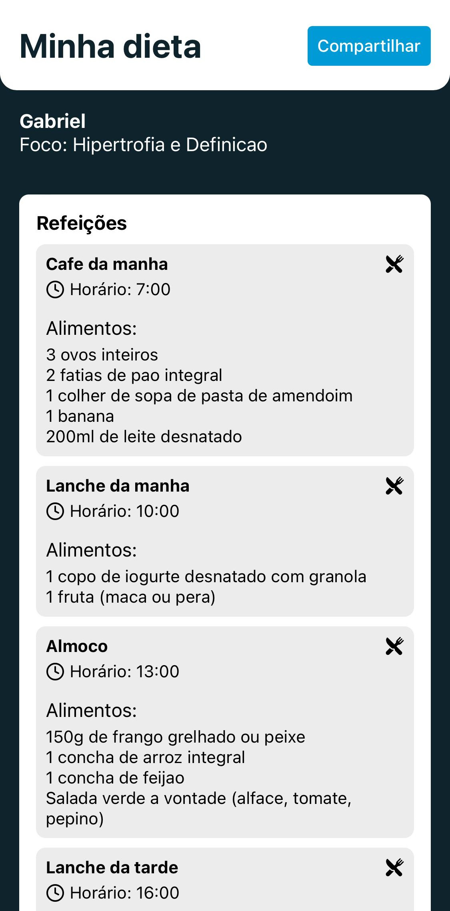

# Gabriel Bino - Portfólio

## Sobre mim
Sou Gabriel Bino.  
Estudante de Sistemas de Informação.

Meu propósito é
**alinhar tecnologia, disciplina e propósito** para gerar impacto real em pessoas.

---

**O que faço hoje:**

Desenvolvo aplicações web e mobile
Com TypeScript, React, React Native, Firebase.

---

**Minhas principais características:**

- Sou dedicado
- Tenho disciplina e foco em execução diária  
- Assumo responsabilidades e busco evolução técnica

---

**Meu objetivo:**  
- Conquistar minha primeira oportunidade profissional como desenvolvedor.  
- Aplicar e expandir minhas habilidades para entregar soluções que impulsionem  
pessoas a alcançarem uma vida de sucesso com propósito.

---

## 💻 Projetos em Destaque

### 1️⃣ Dieta IA
Aplicativo mobile para geração personalizada de dietas utilizando inteligência artificial (Google Gemini API).

**Tecnologias:**  
- React Native  
- TypeScript  
- Zustand  
- Google Gemini API

[🔗 Repositório](https://github.com/gabrielbino/dieta-ia)

---

### 2️⃣ Convite Casamento
Sistema de confirmação de presença e lista de presentes para casamentos, com integração ao Firebase.

**Tecnologias:**  
- TypeScript  
- React  
- Firebase Firestore  
- Firebase Authentication  

🚨 Projeto privado: disponível para demonstração sob solicitação.

---

### 3️⃣ Convite Panela
Versão adaptada para chá de panela, com mesma base tecnológica do convite de casamento.

**Tecnologias:**  
- TypeScript  
- React  
- Firebase  

🚨 Projeto privado: disponível para demonstração sob solicitação.

---

### 4️⃣ Sistema Acadêmico (projeto universitário)
Sistema simples feito em PHP para cadastro e gerenciamento de dados acadêmicos.

**Tecnologias:**  
- PHP com Laravel  
- MySQL  

[🔗 Repositório](https://github.com/gabrielbino/projeto)

---

### 5️⃣ Currículo Responsivo
Site responsivo desenvolvido para estudo e prática de HTML, CSS e media queries.

**Tecnologias:**  
- HTML5  
- CSS3  
- Responsividade  

[🔗 Repositório](https://github.com/gabrielbino/curriculoResponsivo)

---

## 📫 Contato

- E-mail: gabriellf650@gmail.com
- LinkedIn: [https://www.linkedin.com/in/gabrielfbino/](https://www.linkedin.com/in/gabrielfbino/)
- Instagram: [https://www.instagram.com/gabrielfbino/](https://www.instagram.com/gabrielfbino/)
